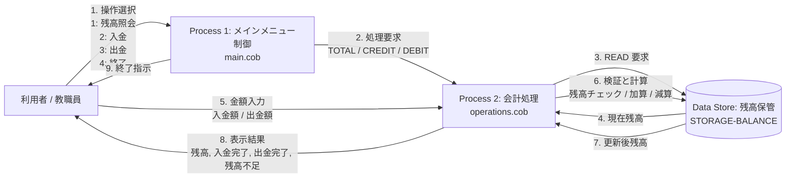

# 学校会計システム COBOL 調査レポート

## 1. 概要
本システムは、学校の会計・口座管理を簡易的に処理するための COBOL アプリケーションです。メインメニューから残高照会、入金、出金、終了を選択でき、内部で現在の残高を保持しながら業務処理を行います。

実装上は「画面制御」「業務ロジック」「データ保持」の3つの要素が分離されており、各プログラムが役割を分担しています。なお、現状の実装はメモリ上の値を保持する仕様であり、永続ストレージへの保存機能はありません。

---

## 2. 各ファイルの目的

| ファイル | 役割 | 主要な責務 |
| --- | --- | --- |
| `src/cobol/main.cob` | エントリーポイント | メニュー表示、ユーザー入力の受付、操作種別の選択、終了判定 |
| `src/cobol/operations.cob` | 業務ロジック | 残高照会、入金、出金の処理、残高不足チェック |
| `src/cobol/data.cob` | データ保持層 | 残高の読み取りと書き込みを担当する簡易ストレージ |

### 2.1 `main.cob` の目的
`MainProgram` は、利用者が対話的に操作する入口です。以下のメニューを表示し、選択肢に応じて `Operations` プログラムを呼び出します。

- 1. View Balance (残高照会)
- 2. Credit Account (入金)
- 3. Debit Account (出金)
- 4. Exit (終了)

ループ処理により、ユーザーが `NO` を選ぶまで続けて利用できます。これは、学校会計の簡易な受付端末のような動作をモデル化したものです。

### 2.2 `operations.cob` の目的
`Operations` は、実際の会計処理を実行するコアロジックです。

- 残高照会: `TOTAL ` の指定で `DataProgram` に `READ` を依頼し、現在残高を表示
- 入金: `CREDIT` で入力金額を受け取り、既存残高に加算し `WRITE` で保存
- 出金: `DEBIT ` で入力金額を受け取り、残高が十分な場合のみ減算し保存
- 残高不足時: `Insufficient funds for this debit.` を表示

このプログラムでは、業務ルールを直接実装しており、会計システムの主要なビジネスロジックがここに集中しています。

### 2.3 `data.cob` の目的
`DataProgram` は、残高値を保持するための簡易データ層です。`READ` と `WRITE` を受け取り、`STORAGE-BALANCE` を更新または参照します。

- `READ`: 保存済み残高を外部の `BALANCE` 変数へコピー
- `WRITE`: 引数の残高を `STORAGE-BALANCE` に反映

これはファイルベースのDBではなく、プロセス内の変数に保存しているため、アプリケーション終了後にはデータが失われる点が重要な制約です。

---

## 3. 主要機能

### 3.1 残高照会
利用者は「1」を選択すると、現在の残高を確認できます。`Operations` が `DataProgram` を呼び、保存値を読み出して表示します。

### 3.2 入金処理
利用者は入金額を入力し、残高に加算します。入金処理後に新しい残高が表示されます。

### 3.3 出金処理
利用者は出金額を入力し、現在残高が十分かどうかを確認します。残高不足時は処理を拒否し、適切なメッセージを表示します。

### 3.4 終了処理
「4. Exit」を選択するとメニューループを終了し、プログラムを終了します。

---

## 4. ビジネス要件の整理

以下はコードから明確に読み取れる要件です。

1. 初期残高は `1000.00` であること
   - `operations.cob` と `data.cob` の両方で初期値が設定されている

2. 口座残高の確認ができること
   - `TOTAL ` コマンドで現在残高を表示

3. 口座へ入金できること
   - 金額を入力し、既存残高に加算する

4. 口座から出金できること
   - 金額を入力し、残高が十分であれば減算する

5. 残高不足時は出金を拒否すること
   - `IF FINAL-BALANCE >= AMOUNT` の条件で検証

6. 事務作業として対話式のメニュー操作を前提とすること
   - コンソール画面でユーザー選択し、手入力で操作する

7. 端末で処理が完結すること
   - DBやファイルへの永続化機能は実装されていない

---

## 5. 調査結果と設計上の重要ポイント

### 5.1 役割分離が明確
本システムは以下のような責務分割になっています。

- `main.cob`: ユーザーインターフェース
- `operations.cob`: 業務ロジック
- `data.cob`: データ保持

この分離により、改修時に業務ロジックとデータアクセスを分けて扱いやすい構造になっています。

### 5.2 簡易的な「会計システム」だが、完全な業務システムではない
現状の実装は学校の帳簿としての本格的な機能を持っていません。特に以下の点は未実装です。

- 複数口座の管理
- 仕訳の記録
- 監査ログ
- 認証・承認フロー
- 勘定科目ごとの管理
- 永続的な保存と復元

### 5.3 コード上の注意点
実装を改修する際には、次の点に注意が必要です。

- `Operation` の識別子に空白が含まれる
  - 例: `'TOTAL '`, `'DEBIT '`, `'CREDIT'`
- `PIC X(6)` の文字列長と実際のオペレーション名の長さに依存している
- 入力値に対する妥当性チェックが不足している
  - 0以下の金額や不正な数値の扱いが未定義
- 1回のプログラム実行中でのみデータが保持される
  - 再起動すると残高が戻る

---

## 6. 現状システムの評価

現状のアプリケーションは、学校会計における最小限の残高管理機能を実現する簡易デモとしては十分に機能しています。特に、会計の基本フローである「照会 → 入金/出金 → 残高更新」が明確に表現されています。

一方で、実運用を考えると次の改善が必要です。

- ファイルベースまたはDBベースの永続化
- 取引履歴の管理
- エラー処理と入力検証
- 複数ユーザーや複数口座への対応
- 監査証跡とセキュリティ対策

---

## 7. データフロー図（DFD）

以下は、システム内でデータがどのように流れるかを表した Mermaid 図です。

このDFDでは、利用者の操作入力がメインメニューで受け取り、会計処理が残高データの読み書きを行い、最終的に結果を画面へ返す流れが示されています。

## 8. まとめ
本アプリケーションは、学校会計の初歩的な残高管理を行う COBOL ベースのシステムであり、`main.cob` が画面制御、`operations.cob` が業務ロジック、`data.cob` が記憶管理を担う構造です。単一残高の簡易管理を前提にした設計であり、今後のモダナイズやクラウド化を進める際の基礎として有効です。

この文書は、既存のレガシーコードを評価し、将来の改善や置き換えを行う際の判断材料として利用できます。
